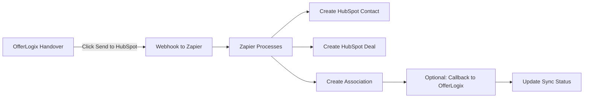

# 🔗 Zapier + HubSpot Integration Setup Guide

This guide will help you set up the Zapier integration to automatically send OfferLogix sales-qualified leads (handovers) to HubSpot CRM.

## 📋 Prerequisites

1. **HubSpot Account** (Free or Paid)
2. **Zapier Account** (Free tier works, Paid recommended for instant triggers)
3. **OfferLogix Platform** deployed and running

## 🚀 Setup Instructions

### Step 1: Configure OfferLogix Environment Variables

Add these to your `.env` file or Render environment:

```env
# Zapier Webhook URL (you'll get this from Step 2)
ZAPIER_WEBHOOK_URL=https://hooks.zapier.com/hooks/catch/YOUR_HOOK_ID/

# Optional: Webhook security secret for callbacks
ZAPIER_WEBHOOK_SECRET=your-secret-key-here
```

### Step 2: Create Your Zap in Zapier

1. **Login to Zapier** and click "Create Zap"

2. **Set up the Trigger:**
   - Choose App: **Webhooks by Zapier**
   - Choose Trigger Event: **Catch Hook**
   - Click Continue
   - Copy the webhook URL provided
   - Add this URL to your `.env` as `ZAPIER_WEBHOOK_URL`
   - Click "Test trigger" (we'll send test data later)

3. **Set up Action 1 - Create/Update HubSpot Contact:**
   - Choose App: **HubSpot**
   - Choose Action Event: **Create or Update Contact**
   - Connect your HubSpot account
   - Map the fields:
     ```
     Email: email
     First Name: firstName
     Last Name: lastName
     Phone Number: phone
     Company Name: companyName
     Job Title: decisionMakerRole
     Lead Status: "OPEN"
     
     # Custom Properties (create these in HubSpot first):
     Dealership Type: dealershipType
     Product Interest: productInterest
     Lead Score: leadScore
     Annual Volume: annualVolume
     Current Provider: currentFinanceProvider
     OfferLogix Lead ID: customFields__offerlogix_lead_id
     ```
   - Test the action with sample data

4. **Set up Action 2 - Create HubSpot Deal:**
   - Choose App: **HubSpot**
   - Choose Action Event: **Create Deal**
   - Map the fields:
     ```
     Deal Name: "{{companyName}} - OfferLogix Platform"
     Deal Stage: "Qualified to Buy" (or your equivalent)
     Amount: Calculate based on annual volume or use default
     Close Date: 30 days from today
     Pipeline: Default or your sales pipeline
     
     # Custom Properties:
     Product Type: productInterest
     Lead Score: leadScore
     OfferLogix Handover ID: customFields__offerlogix_handover_id
     ```

5. **Set up Action 3 - Associate Contact with Deal:**
   - Choose App: **HubSpot**
   - Choose Action Event: **Create Association**
   - Configure:
     ```
     From Object Type: Contact
     From Object: Use the ID from Step 3 (Create Contact)
     To Object Type: Deal  
     To Object: Use the ID from Step 4 (Create Deal)
     Association Type: Contact to Deal
     ```

6. **Optional - Set up Action 4 - Send Callback to OfferLogix:**
   - Choose App: **Webhooks by Zapier**
   - Choose Action Event: **POST**
   - Configure:
     ```
     URL: https://your-offerlogix-domain.com/api/zapier/webhook-callback
     Payload Type: JSON
     Data:
       handoverId: {{salesBriefId}}
       leadId: {{customFields__offerlogix_lead_id}}
       hubspotContactId: {{HubSpot Contact ID from Step 3}}
       hubspotDealId: {{HubSpot Deal ID from Step 4}}
       status: "success"
     Headers:
       X-Zapier-Signature: {{your-webhook-secret}}
     ```

### Step 3: Create Custom Properties in HubSpot

1. Go to HubSpot → Settings → Properties
2. Create these custom properties for Contacts:
   - `dealership_type` (Dropdown: franchise, independent, buy-here-pay-here)
   - `product_interest` (Text)
   - `lead_score` (Number)
   - `annual_volume` (Number)
   - `current_finance_provider` (Text)
   - `offerlogix_lead_id` (Text)
   - `offerlogix_sync_date` (Date)

3. Create these custom properties for Deals:
   - `offerlogix_handover_id` (Text)
   - `product_type` (Text)
   - `lead_temperature` (Dropdown: hot, warm, cold)

### Step 4: Test the Integration

1. **Send Test Data from OfferLogix:**
   - Go to the Handovers page in OfferLogix
   - Click "Send to HubSpot" on any handover
   - Check Zapier to see if the webhook was received

2. **Verify in HubSpot:**
   - Check Contacts for the new contact
   - Check Deals for the associated deal
   - Verify the association is created

### Step 5: Run Database Migration

Run this SQL to add HubSpot tracking columns:

```bash
psql $DATABASE_URL -f add-hubspot-columns.sql
```

## 📊 Data Flow



## 🔍 Monitoring & Troubleshooting

### Check Sync Status

Each handover shows its sync status:
- **Gray "Send to HubSpot"** - Not synced yet
- **Spinning "Syncing..."** - Currently sending
- **Green "Synced"** - Successfully sent to HubSpot
- **Red error** - Sync failed (check logs)

### Common Issues

1. **"Zapier integration not configured"**
   - Add `ZAPIER_WEBHOOK_URL` to environment variables

2. **Webhook not triggering**
   - Ensure Zap is turned ON in Zapier
   - Check webhook URL is correct
   - Test with Zapier's webhook tester

3. **HubSpot contact not created**
   - Verify HubSpot connection in Zapier
   - Check field mappings
   - Ensure email is valid

4. **Missing custom properties**
   - Create custom properties in HubSpot first
   - Map them correctly in Zapier

## 💰 Zapier Pricing Considerations

- **Free Plan:** 100 tasks/month, 15-minute checks
- **Starter ($19.99/mo):** 750 tasks, instant triggers
- **Professional ($49/mo):** 2000 tasks, 2-minute checks

Each handover sync uses approximately:
- 1 task for trigger
- 3 tasks for actions (Contact, Deal, Association)
- 1 task for callback (optional)
= **5 tasks total per handover**

## 🔐 Security Notes

1. **Webhook URL:** Keep your Zapier webhook URL private
2. **Callback Secret:** Use a strong secret for webhook callbacks
3. **API Limits:** HubSpot has rate limits (100 requests/10 seconds)
4. **Data Privacy:** Ensure compliance with data protection regulations

## 📞 Support

For issues with:
- **OfferLogix Integration:** Contact your admin
- **Zapier Setup:** support.zapier.com
- **HubSpot Configuration:** knowledge.hubspot.com

---

## Quick Test Checklist

- [ ] Environment variables configured
- [ ] Zap created and turned ON
- [ ] HubSpot custom properties created
- [ ] Test handover sent successfully
- [ ] Contact appears in HubSpot
- [ ] Deal created and associated
- [ ] Sync status shows "Synced" in OfferLogix